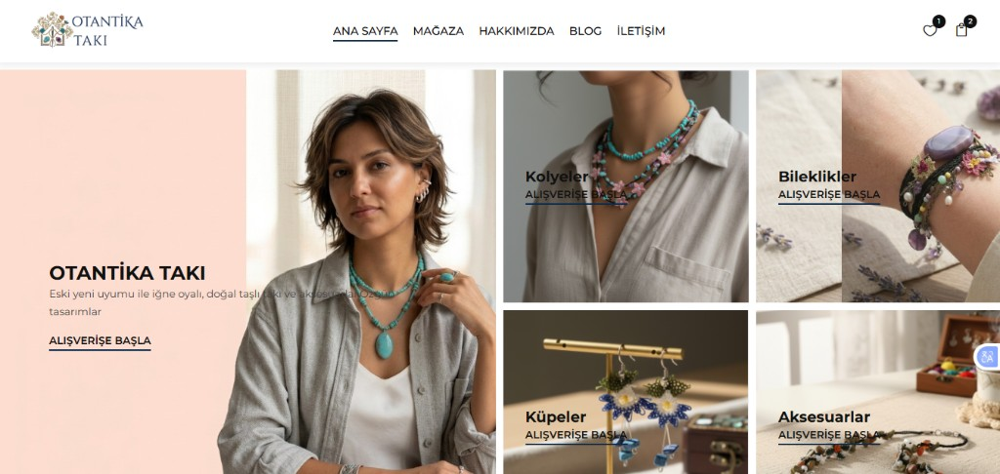
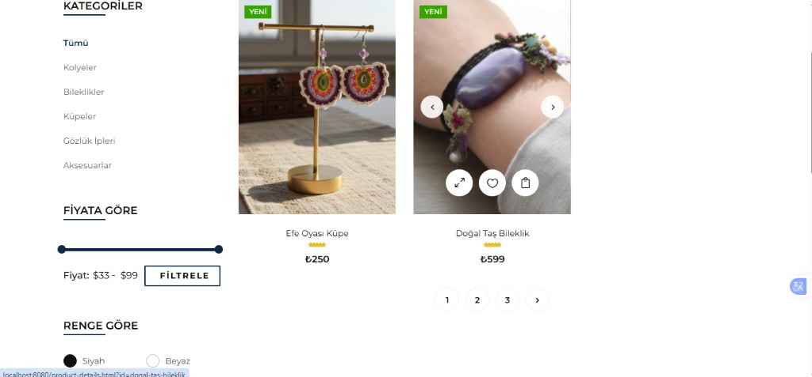
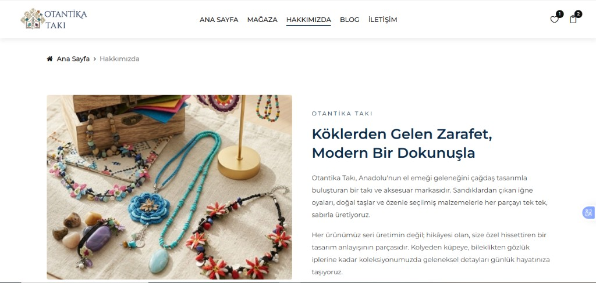
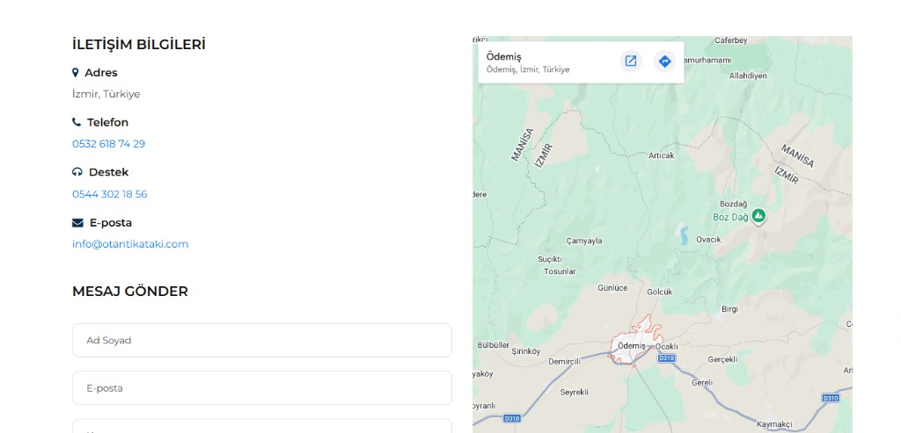
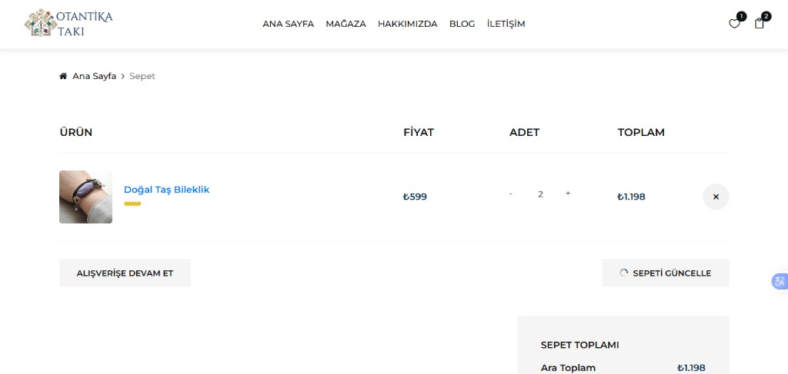
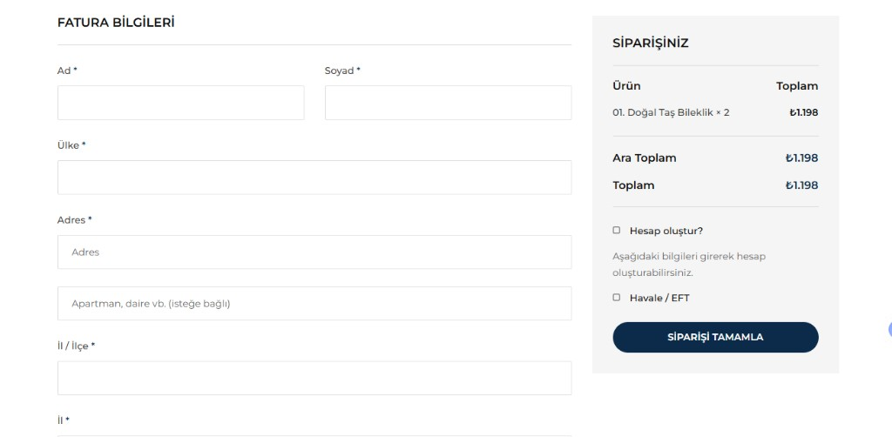

# Otantika Takı

El yapımı takı vitrin sitesi — statik ön yüz, Flask REST API ve admin paneli. Ürün, kategori ve blog verileri `data/` altındaki JSON dosyalarında tutulur.

> Portfolyo / demo projesi — canlı yayında değil.

## Ekran görüntüleri

### Ana sayfa


### Mağaza


### Hakkımızda


### İletişim


### Sepet


### Ödeme


## Özellikler

- Kategori, fiyat ve renk filtreleri
- Ürün detay, sepet ve favoriler
- Blog ve iletişim sayfaları
- Admin paneli ile ürün, kategori ve blog yönetimi (CRUD)
- Görsel yükleme ve JSON tabanlı veri saklama

## Gereksinimler

- Python 3.10 veya üzeri

## Kurulum

```bash
python -m venv .venv
.venv\Scripts\activate
pip install -r requirements.txt
```

Admin şifresi için örnek dosyayı kopyalayın ve şifreyi değiştirin:

```bash
copy data\admin.example.json data\admin.json
```

## Geliştirme sunucusu

```bash
python server\app.py
```

- Site: http://localhost:8080
- Admin: http://localhost:8080/admin/

## Ortam değişkenleri (isteğe bağlı)

| Değişken | Açıklama |
|----------|----------|
| `PORT` | Sunucu portu (varsayılan: 8080) |
| `OTANTIKA_BASE_DIR` | Proje kök dizini |
| `OTANTIKA_SECRET` | Flask oturum anahtarı |

## Proje yapısı

```
admin/          Admin panel arayüzü
css/, js/       Ön yüz dosyaları
data/           JSON veri dosyaları
docs/           Ekran görüntüleri
img/            Ürün, blog ve kategori görselleri
sass/           SCSS kaynakları (derlenmiş çıktı: css/style.css)
server/         Flask API (app.py)
```

## Git notları

Depoya dahil edilmeyenler: `build/`, `dist/`, `*.exe`, `Source/`, `data/admin.json`, sanal ortam ve log dosyaları.
